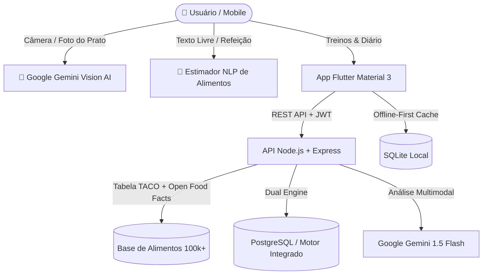

<div align="center">

# 🏋️‍♂️ FitLife AI — Ecossistema Inteligente de Saúde, Treino & Nutrição

[](https://github.com/Matheusg0ulart/app-academia/releases)
[](https://flutter.dev)
[](https://nodejs.org)
[](https://aistudio.google.com)
[](https://www.postgresql.org)
[](https://www.sqlite.org)
[](https://nodejs.org/api/test.html)

**O aplicativo definitivo para musculação, dieta flexível e acompanhamento físico potencializado por Inteligência Artificial.**

> 🚀 **Avaliadores & Entrevistadores:** Para testar o aplicativo imediatamente no seu smartphone Android sem precisar compilar o código, baixe o APK pronto em **[Releases](https://github.com/Matheusg0ulart/app-academia/releases)**!

---

### 👨‍💻 Desenvolvedor
**Matheus Ferreira Goulart**  
🎓 *Tecnologia em Análise e Desenvolvimento de Sistemas — Senac*  
💼 *Projeto de Portfólio & Demonstração Técnica de Alto Padrão*  

</div>

---

## 📌 Sumário
- [1. Visão Geral do Projeto](#1-visão-geral-do-projeto)
- [2. Arquitetura & Tecnologias](#2-arquitetura--tecnologias)
- [3. Funcionalidades em Destaque](#3-funcionalidades-em-destaque)
- [4. 📱 Como Baixar e Instalar o APK (Android)](#4--como-baixar-e-instalar-o-apk-android)
- [5. 💻 Como Rodar o Projeto no PC (Passo a Passo)](#5--como-rodar-o-projeto-no-pc-passo-a-passo)
- [6. 🧪 Suíte de Testes Automatizados](#6--suíte-de-testes-automatizados)
- [7. Licença](#7-licença)

---

## 1. Visão Geral do Projeto

O **FitLife AI** une ciência esportiva, nutrição baseada em dados e Inteligência Artificial multimodal de última geração. O aplicativo resolve as maiores dores dos praticantes de atividade física: estimativa rápida de calorias, fichas de treino periodizadas, controle de hidratação, cálculo de anilhas e acompanhamento visual da evolução física.



---

## 2. Arquitetura & Tecnologias

### 📱 Frontend Mobile
- **Flutter 3 & Dart:** Interface fluida, moderna em tema escuro (*Dark Slate + Verde Neon*);
- **CustomPainter Gráficos:** Renderização nativa de curvas suaves de Bezier e desenho das anilhas da barra;
- **SQLite (`sqflite`):** Arquitetura *Offline-First* com sincronização automática;
- **Image Picker:** Captura de fotos em alta resolução pela câmera ou galeria para análise da IA.

### ⚡ Backend REST
- **Node.js & Express:** Arquitetura limpa em camadas (*Controllers, Services, Models, Middlewares*);
- **Google Gemini SDK (`@google/generative-ai`):** Reconhecimento visual de pratos de comida e assistente conversacional;
- **Base de Alimentos TACO (UNICAMP):** Mais de 80 alimentos naturais brasileiros embarcados;
- **Open Food Facts API:** Busca de produtos industrializados e leitor de código de barras (EAN);
- **Autenticação Segura:** Tokens JWT com criptografia `bcryptjs` de senhas.

---

## 3. Funcionalidades em Destaque

### 🧠 Inteligência Artificial & Nutrição
* **📸 Scanner de Prato com Gemini Vision:** Fotografe o prato de comida e a IA identifica os alimentos, calcula as porções em gramas, estima os 4 macronutrientes (Kcal, Proteínas, Carbos, Gorduras) e adiciona ao diário com 1 toque.
* **🧠 Visão do Prato (Texto Livre):** Digite o que comeu em linguagem natural (ex: *"2 fatias de pão integral com 3 ovos mexidos e 1 banana"*) e o parser calcula automaticamente.
* **🥗 Base de Alimentos Brasileira & Barcode:** Integração com a tabela oficial TACO (naturais) + Open Food Facts com busca textual e código de barras.
* **🍽️ Divisor Inteligente de Metas:** Distribui a meta calórica e proteica do usuário de forma balanceada pelas 6 refeições do dia.
* **🔍 Comparador Nutricional:** Coloque 2 alimentos frente a frente e veja qual tem maior densidade proteica (g/100kcal) com veredito da IA.

### 🏋️‍♂️ Treinos & Esporte
* **🤖 Gerador de Fichas com IA:** Gera rotinas completas balanceadas (PPL, Upper/Lower, Full Body) conforme objetivo e nível.
* **⏱️ Modo Treino ao Vivo:** Cronômetro de descanso entre séries, checklist e registro de esforço percebido (RPE).
* **⏱️ Cronômetro HIIT & Tabata:** Temporizador dinâmico com modos Tabata (20/10), HIIT 30/30 e EMOM com estimativa de queima calórica.
* **🏋️ Calculadora de Anilhas (Plate Calculator):** Desenha graficamente a barra com as anilhas coloridas exatas para cada carga.

### 📈 Evolução, Gamificação & Métricas
* **📊 Gráficos Visuais de Evolução:** Curvas de peso com linha de meta tracejada e comparativo antes/depois de circunferências corporais.
* **🎯 Simulador de Projeção Temporal:** Calcula em quantas semanas e em qual data exata o usuário atingirá o peso desejado.
* **🏆 Conquistas & Gamificação (Badges):** Sistema de Níveis, XP acumulado e medalhas de ouro, prata e bronze.
* **💧 Cronograma Horário de Hidratação:** Linha do tempo de copos de água dividida por períodos do dia.
* **📄 Exportador de Relatório (PDF / WhatsApp):** Relatório formatado com 1 clique para envio ao Personal Trainer ou Nutricionista.

---

## 4. 📱 Como Baixar e Instalar o APK (Android)

> 💡 **Dica para Avaliadores & Entrevistadores:** Não é necessário configurar ambiente local nem compilar código para testar a aplicação no celular! Você pode baixar o APK compilado diretamente abaixo em segundos:

<div align="center">

### 📥 Opção 1: Download Direto (Releases do GitHub)

[](https://github.com/Matheusg0ulart/app-academia/releases)

🔗 **[Acessar a página de Releases para baixar a versão mais recente](https://github.com/Matheusg0ulart/app-academia/releases)**

</div>

#### 📋 Passo a Passo de Instalação:

| Etapa | Ação | O que fazer |
| :---: | :--- | :--- |
| **1** | **Download** | Acesse [Releases](https://github.com/Matheusg0ulart/app-academia/releases) pelo celular e baixe o arquivo `fitlife-ai.apk` (ou `app-release.apk`). |
| **2** | **Abrir** | Toque na notificação de download concluído ou abra o gerenciador de arquivos do celular na pasta **Downloads**. |
| **3** | **Permissão** | Caso o Android solicite autorização para *"Instalar aplicativos de fontes desconhecidas"*, clique em **Configurações** e marque a opção **Permitir desta fonte**. |
| **4** | **Pronto!** | Clique em **Instalar** e abra o aplicativo. O **FitLife AI** estará 100% pronto para uso e demonstração. |

---

### 🛠️ Opção 2: Gerar o APK pelo Código Fonte (Desenvolvedores)

Se você possui o [Flutter SDK](https://flutter.dev) instalado e prefere gerar o build manualmente:

```bash
# 1. Navegue até a pasta do frontend
cd fitlife-ai/frontend

# 2. Obtenha as dependências
flutter pub get

# 3. Gere o APK de produção otimizado
flutter build apk --release
```

O arquivo `.apk` final será gerado no diretório:  
📂 `fitlife-ai/frontend/build/app/outputs/flutter-apk/app-release.apk`

---

## 5. 💻 Como Rodar o Projeto no PC (Passo a Passo)

### 📋 Pré-requisitos
- [Node.js](https://nodejs.org/) versão 18 ou superior instalado;
- [Flutter SDK](https://flutter.dev/docs/get-started/install) (versão 3.x) instalado;
- [Git](https://git-scm.com/) instalado;
- Chave gratuita da API do **Google Gemini** (obtenha em [Google AI Studio](https://aistudio.google.com/app/apikey)).

---

### 1️⃣ Clonar o Repositório
```bash
git clone https://github.com/Matheusg0ulart/app-academia.git
cd app-academia
```

---

### 2️⃣ Configurar e Iniciar o Backend (Node.js)

1. Entre na pasta do backend:
   ```bash
   cd fitlife-ai/backend
   ```

2. Instale as dependências:
   ```bash
   npm install
   ```

3. Configure o arquivo `.env`:
   Abra o arquivo `.env` (ou copie do `.env.example`) e adicione sua chave do Gemini:
   ```env
   PORT=3000
   NODE_ENV=development
   JWT_SECRET=fitlife_ai_super_secret_jwt_key_2026_production_ready
   GEMINI_API_KEY=sua_chave_do_google_ai_studio_aqui
   ```

4. Inicie o servidor da API:
   ```bash
   npm start
   ```
   > 🚀 O servidor iniciará em: **`http://localhost:3000`**

---

### 3️⃣ Iniciar o Aplicativo Frontend (Flutter)

1. Em outro terminal, acesse a pasta do frontend:
   ```bash
   cd fitlife-ai/frontend
   ```

2. Baixe as dependências do Flutter:
   ```bash
   flutter pub get
   ```

3. Execute o aplicativo:
   - **No Celular conectado via USB ou Emulador Android:**
     ```bash
     flutter run
     ```
   - **No Navegador Web (Chrome):**
     ```bash
     flutter run -d chrome
     ```
   - **No Windows Desktop:**
     ```bash
     flutter run -d windows
     ```

---

## 6. 🧪 Suíte de Testes Automatizados

O backend possui uma suíte completa com **22 testes automatizados nativos**:

```bash
cd fitlife-ai/backend
npm test
```

```
▶ FitLife AI API - Comprehensive Test Suite
  ✔ 1. Health check should return status ok
  ✔ 2. Auth - Register user
  ✔ 3. Users - Get authenticated profile
  ✔ 4. Users - Update profile data
  ✔ 5. Exercises - List catalog and filter by muscle group
  ✔ 6. Exercises - Create custom exercise
  ✔ 7. Workouts - Create routine and fetch details
  ✔ 8. Workout Logs - Start session, log sets, and finish workout
  ✔ 9. Nutrition - Log meal and get daily summary
  ✔ 10. Measurements - Log weight & circumferences and get evolution
  ✔ 11. Calculators - TMB, TDEE and Exercise MET calories
  ✔ 12. Dashboard - Aggregated summary
  ✔ 13. AI Assistant - Contextual answers & Safety guardrails
  ✔ 14. Food Search - TACO natural foods + Open Food Facts industrialized
  ✔ 15. Smart Workout Generator by AI / Profile
  ✔ 16. Barcode Search & Fast Cache
  ✔ 17. AI Plate Estimator by Free Text (NLP)
  ✔ 18. Smart Meal Targets Distribution
  ✔ 19. Gamification & Badges System
  ✔ 20. Complete Evolution Report Export
  ✔ 21. Weight Projection Simulator (Deficit / Surplus)
  ✔ 22. Gemini Vision Plate Scanner Route & Validation
✔ FitLife AI API - Comprehensive Test Suite (22 passed, 0 failed)
```

---

## 7. Licença

Distribuído sob a licença MIT. Consulte `LICENSE` para obter mais informações.

<div align="center">
Desenvolvido com 💚 e dedicação por <b>Matheus Ferreira Goulart</b>.
</div>
