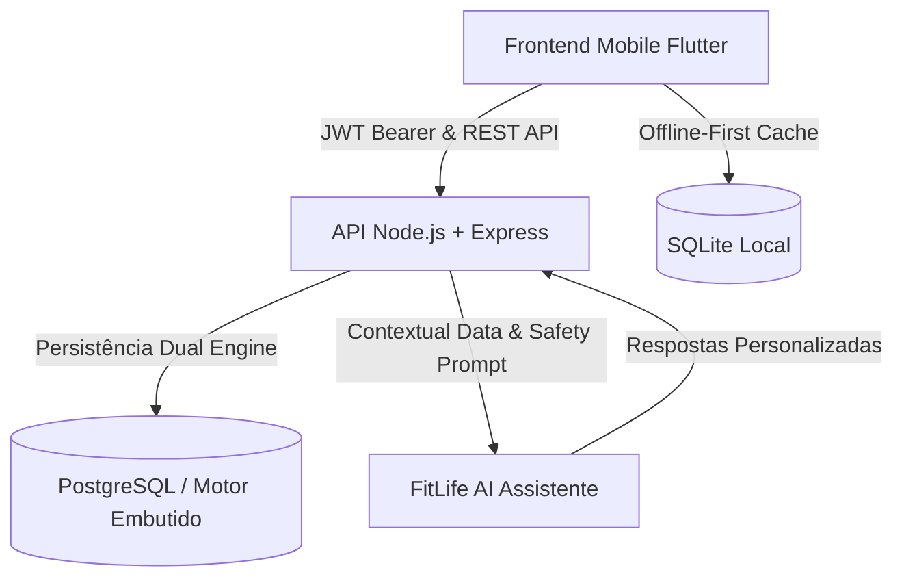

# FitLife AI 🏋️‍♂️🤖

> **Aplicativo de Treino, Nutrição e Assistente Inteligente**  
> **Desenvolvedor:** Matheus Ferreira Goulart  
> **Curso:** Tecnologia em Análise e Desenvolvimento de Sistemas — Senac  
> **Tipo de projeto:** Projeto pessoal / Portfólio  
> **Versão:** 1.0 (MVP Completo)

---

## 1. Visão Geral

O **FitLife AI** é uma plataforma completa e integrada para acompanhamento de treinos, controle nutricional, estimativa de gasto calórico, cálculo de metabolismo e evolução física.

O grande diferencial do projeto é o **FitLife AI Assistente**, uma Inteligência Artificial integrada ao backend que analisa o contexto do usuário (treinos recentes, calorias consumidas no dia, histórico de cargas e metas) para fornecer orientações práticas, dicas de execução e resumos motivacionais de forma ética e segura.



---

## 2. Tecnologias Utilizadas

### 📱 Frontend (Mobile)
- **Flutter** (Framework multiplataforma) & **Dart**
- **Material 3 Design System** com tema escuro (Verde Esmeralda `#00E676` + Slate `#12181B`)
- **SQLite (sqflite)** para persistência local offline-first
- **SharedPreferences** para armazenamento seguro de tokens JWT
- **HTTP client** com interceptação e renovação de cabeçalhos de autenticação

### ⚡ Backend (API REST)
- **Node.js** (v18+) & **Express.js**
- **Autenticação JWT** (JSON Web Tokens) com senhas criptografadas via **bcryptjs**
- **Dual Database Engine**: Suporte nativo ao **PostgreSQL** (Neon.tech / Local) com fallback automático para motor embutido/offline
- **Módulo de IA Contextual**: Injeção inteligente de métricas e barreiras de segurança médica
- **Suíte de Testes Automatizados** nativa do Node.js (`node --test`)

---

## 3. Funcionalidades Implementadas

| Módulo | Descrição |
| :--- | :--- |
| **🔐 Autenticação** | Cadastro completo (idade, sexo, peso, altura, objetivo, atividade), Login JWT, Logout e Perfil do usuário. |
| **📊 Dashboard & Gamificação** | Resumo diário de calorias, cronograma horário de água, sequência da semana, atalhos de ferramentas e **Sistema de Conquistas (Níveis, XP e Medalhas)**. |
| **🏋️‍♂️ Treinos & Gerador com IA** | Fichas personalizadas e **Gerador Automático de Treinos com IA** (PPL, Upper/Lower, Full Body) baseado no perfil e nível. |
| **⏱️ Execução ao Vivo & Histórico** | Treino em tempo real com descanso entre séries, checklist, avaliação de esforço (RPE) e histórico de volume em kg. |
| **⏱️ Cronômetro HIIT & Tabata** | Modos Tabata (20/10), HIIT 30/30 e EMOM com cores dinâmicas e estimativa de calorias queimadas. |
| **📖 Catálogo de Exercícios** | Catálogo com ~60 exercícios cobrindo todos os grupos musculares, busca textual, filtros e instruções passo a passo. |
| **🥗 Nutrição & Base de Alimentos** | Diário alimentar integrado com a **Tabela TACO (alimentos naturais brasileiros)** + **Open Food Facts (industrializados)** com busca por texto e **Leitor de Código de Barras (EAN)**. |
| **📸 Scanner de Prato com IA (Gemini Vision)** | Fotografa o prato de comida e a IA do **Google Gemini** identifica os alimentos, calcula as porções e macros e insere no diário com 1 toque. |
| **🧠 Visão do Prato (Texto Livre)** | Descreva a refeição em linguagem natural e a IA calcula calorias, porções e macros automaticamente. |
| **🍽️ Metas Inteligentes por Refeição** | Divisão proporcional de calorias e proteínas em cada uma das 6 refeições com barra de progresso individual. |
| **🧮 Calculadoras Fisiológicas & Precisão** | Cálculo de TMB, TDEE, queima por atividade (MET), **Simulador de Déficit/Superávit com Projeção Temporal de Semanas** e **Calculadora Visual de Anilhas na Barra (Plate Calculator)**. |
| **🔍 Comparador de Alimentos** | Comparador nutricional lado a lado com densidade proteica (g/100kcal) e veredito inteligente da IA. |
| **📈 Evolução & Gráficos** | Curvas de Bezier suaves de peso com linha de meta, comparativo de circunferências em barras e histórico de medições. |
| **📄 Relatório de Evolução** | Gerador e exportador de relatório executivo com resumo antropométrico, metabólico e de treino para envio ao Personal Trainer ou Nutricionista. |
| **🤖 FitLife AI Assistente** | Chatbot contextual com o Google Gemini sobre execução de treinos, nutrição e guardrails de segurança. |

---

## 4. Estrutura do Projeto

```text
fitlife-ai/
│
├── frontend/                     # Aplicativo Mobile em Flutter
│   ├── lib/
│   │   ├── core/                 # Configurações, temas, constantes e SQLite
│   │   │   ├── constants/        # AppConstants
│   │   │   ├── database/         # DatabaseHelper e LocalSchema (SQLite)
│   │   │   └── theme/            # AppTheme (Material 3 Dark)
│   │   ├── models/               # Modelos de dados (User, Workout, Nutrition, etc.)
│   │   ├── routes/               # Sistema de rotas (AppRoutes)
│   │   ├── screens/              # Telas da aplicação (Dashboard, Treinos, Nutrição, IA...)
│   │   ├── services/             # ApiService, LocalDbService, SyncService
│   │   ├── widgets/              # Componentes reutilizáveis
│   │   └── main.dart             # Ponto de entrada Flutter
│   └── pubspec.yaml              # Dependências do Flutter
│
├── backend/                      # API REST em Node.js + Express
│   ├── src/
│   │   ├── config/               # db.js (Configuração de conexão híbrida Postgres/Local)
│   │   ├── controllers/          # Controladores (auth, workout, nutrition, ai...)
│   │   ├── middlewares/          # auth.middleware.js, error.middleware.js
│   │   ├── models/               # Repositories e modelos SQL
│   │   ├── routes/               # Endpoints REST (auth, workouts, nutrition, ai, etc.)
│   │   ├── services/             # Regras de negócio, cálculos TMB/MET e IA
│   │   └── app.js                # App Express configurado
│   ├── tests/                    # Suíte de testes automatizados (api.test.js)
│   ├── server.js                 # Ponto de entrada do servidor
│   ├── package.json              # Dependências e scripts
│   └── .env                      # Variáveis de ambiente
│
├── database/                     # Estrutura SQL
│   ├── migrations/               # Scripts de criação de tabelas 001 a 009
│   ├── seeds/                    # População inicial de exercícios
│   └── migrate.js                # Runner de migração
│
└── README.md
```

---

## 5. Como Executar e Testar o Backend

### 1. Entrar na pasta do backend e instalar dependências
```bash
cd fitlife-ai/backend
npm install
```

### 2. Rodar a suíte de testes automatizados
```bash
npm test
```
*Todos os 13 testes de integração serão executados validando autenticação, treinos, nutrição, calculadoras e IA.*

### 3. Iniciar o servidor
```bash
npm run dev
# ou
npm start
```
O servidor estará rodando em: `http://localhost:3000`

---

## 6. Endpoints Principais da API REST

| Método | Rota | Descrição | Autenticação |
| :--- | :--- | :--- | :---: |
| `GET` | `/api/health` | Status de saúde da API | Não |
| `POST` | `/api/auth/register` | Cadastro de novo usuário | Não |
| `POST` | `/api/auth/login` | Login e obtenção de token JWT | Não |
| `GET` | `/api/users/me` | Dados do perfil logado | Sim (Bearer) |
| `PATCH`| `/api/users/me` | Atualização de peso, altura, objetivo | Sim (Bearer) |
| `GET` | `/api/dashboard/summary` | Resumo consolidado do dia | Sim (Bearer) |
| `GET` | `/api/exercises` | Lista do catálogo com filtro muscular | Sim (Bearer) |
| `POST` | `/api/exercises` | Cadastra exercício customizado | Sim (Bearer) |
| `GET` | `/api/workouts` | Lista fichas de treino do usuário | Sim (Bearer) |
| `POST` | `/api/workouts` | Cria nova ficha de treino | Sim (Bearer) |
| `POST` | `/api/workout-logs` | Inicia sessão de treino | Sim (Bearer) |
| `POST` | `/api/workout-logs/:id/sets`| Registra série executada (carga/reps) | Sim (Bearer) |
| `PATCH`| `/api/workout-logs/:id/finish`| Finaliza treino com duração e nota | Sim (Bearer) |
| `POST` | `/api/nutrition` | Registra refeição e calorias | Sim (Bearer) |
| `GET` | `/api/nutrition/daily` | Resumo nutricional diário e macros | Sim (Bearer) |
| `POST` | `/api/measurements` | Registra medidas e peso corporal | Sim (Bearer) |
| `POST` | `/api/calculators/tmb-tdee`| Calcula TMB e TDEE metabólico | Opcional |
| `POST` | `/api/calculators/exercise-calories`| Estima queima de calorias por MET | Opcional |
| `POST` | `/api/ai/chat` | Envia mensagem para o Assistente IA | Sim (Bearer) |

---

## 7. Como Executar o Frontend (Flutter)

### 1. Entrar na pasta do frontend
```bash
cd fitlife-ai/frontend
```

### 2. Obter dependências do Flutter
```bash
flutter pub get
```

### 3. Executar o aplicativo
```bash
flutter run
```

---

## 8. Segurança e Limites da IA (Guardrails)

A IA do **FitLife AI** foi desenhada seguindo rigorosos princípios éticos de segurança:
- **Não realiza prescrição de remédios nem diagnósticos clínicos.**
- Em perguntas sensíveis (medicamentos, lesões graves), aciona guardrails automáticos orientando a busca por um profissional de saúde.
- Todas as chaves e processamento sensível ocorrem no servidor, garantindo proteção de dados.
